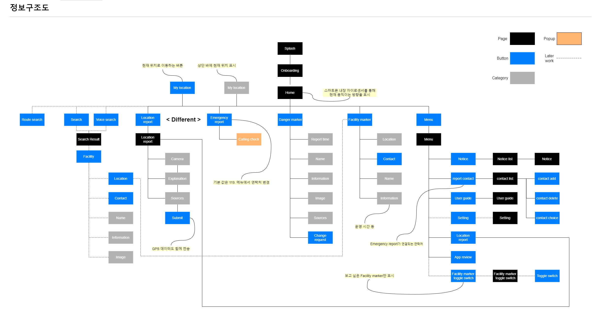
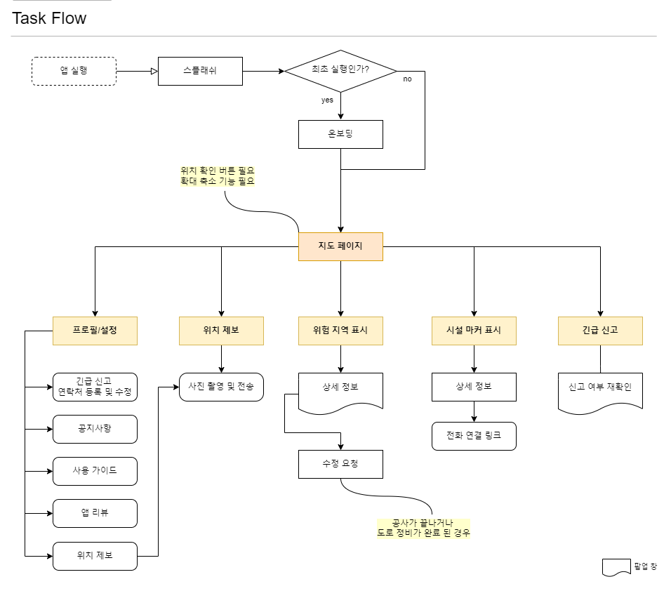

# UMC_Hackathon
2nd UMC Hackathon 7/1 ~ 7/2 진행

### [TEAM INFO]
#### Name
- 34번 | 어빌리티맵
   
#### Member
> App (Android)
- 임재완(PM)  [@jaewan0114](https://github.com/jaewan0114)
- 오상희 [@sh-532](https://github.com/sh-532)     
- 정현규 [@hkjeong2](https://github.com/hkjeong2)   

> Server (Node.js)
- 서위영 [@HBSPS](https://github.com/HBSPS)   
- 윤진난 [@Jinnan-Yun](https://github.com/Jinnan-Yun)   
- 곽정아 [@JungAh](https://github.com/Jungahgo)   
   
> Designer 
- 정민희

#### 참고사항
- contributor : 곽정아, 정현규는 2일 중 1일 참여하였고 파일을 팀원들이 이어받아 작업하였습니다.   
- 작업 : 실행화면 / 데이터 / 마커 / 메인지도
   
------------- 
### [아이디어 소개]   

#### 어빌리티 맵
편의시설과 위험지역에 대한 정보 제공으로  **교통약자의 안전과 이동편의 증진**  
> _#편의증진_ _#교통약자_ _#사회적가치_ _#사회적문제해결_ _#지도_
   
### 구현 기능
~~작성하기~~
     
#### Information Architecture
   

#### Flow Chart
 
